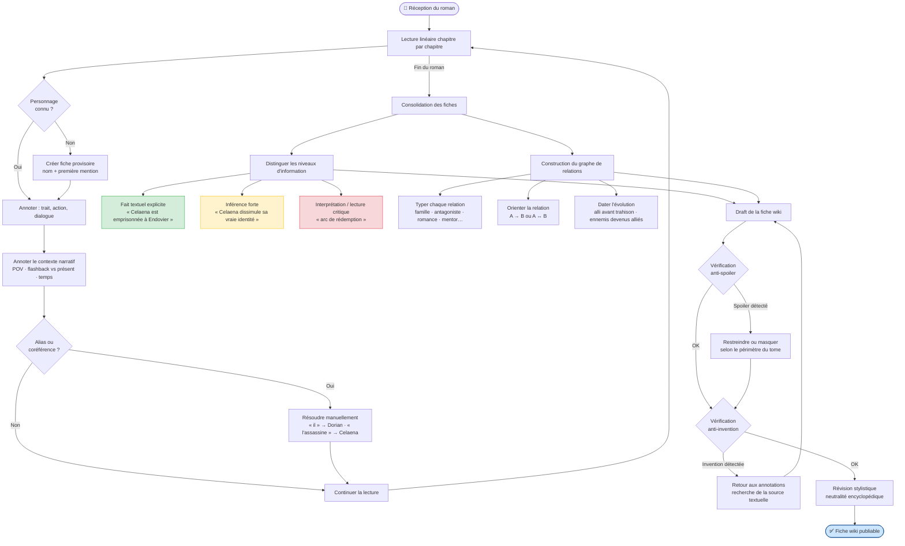

# Flow Audit — Wiki Creator vs. Analyste Humain

> Généré le 2026-03-21. Base : code source, pipelines YAML, contrats `.studio/contracts/`.

---

## Diagramme 1 — Happy Flow : Analyste Littéraire Professionnel

---

## Diagramme 2 — Flow Actuel du Pipeline Wiki Creator

```mermaid
flowchart TD
    subgraph INPUT["📂 Entrée"]
        YML([book.yaml\n+ EPUB])
    end

    subgraph EX["🔵 wiki-extraction  ·  déterministe"]
        EX1["parse_epub.py\nExtraction texte brut + détection POV"]
        EX2["entity_extraction.py\nspaCy NER → entités brutes\nmin_mentions filtre"]
        EX3["entity_clustering.py\nFuzzy matching → clusters de noms"]
        EX4["verify_entity_types.py\n⚡ LLM (Ollama) — validation types ambigus\noptionnel"]
        EX5["split_clusters.py\nPartition PERSON / PLACE / ORG / EVENT / OTHER\n→ processing_output/splits.json"]
    end

    subgraph RE["🟡 wiki-resolution  ·  déterministe"]
        RE1["resolve_clusters.py\nNormalisation des clusters"]
        RE2["merge_entities.py\nFusion singles + résolus\n→ processing_output/*_full.json"]
        RE3["relationship_extraction.py\nCo-occurrence graph (fenêtre N mots)\n→ processing_output/relationships.json"]
        RE4["alias_resolution.py\nMerge conservatif PERSON\nsans LLM"]
        RE5["entity_classification.py\nImportance : principal / secondary / figurant / ignored\n→ processing_output/entities_classified.json"]
        RE6["save_relationships.py\n→ processing_output/relationships.json"]
    end

    subgraph CL["🟠 classify-relationships  ·  LLM par paire"]
        CL1["classify_relationships.py\nItère sur chaque paire\n⚡ LLM — relationship-classifier-item\n→ relationship_type · direction · evolution · key_moments"]
        CL2["→ processing_output/relationships_classified.json"]
    end

    subgraph PR["🟢 wiki-preparation  ·  déterministe"]
        PR1["chapter_summary.py\nRésumé extractif par chapitre\nDétection temporal_context (flashback vs présent)\n→ processing_output/chapter_summaries.json"]
        PR2["wiki_preparation.py\nConstruction des batch files\nRegroupe entité + résumés + relations\n→ wiki_inputs/batch_*.json"]
    end

    subgraph GEN["🔴 generate-pages  ·  LLM par entité"]
        GEN1["generate_wiki_pages.py\nLit batch_*.json\n⚡ LLM (Ollama) — wiki-page-item\nGénère : title · importance · infobox · content"]
        GEN2["→ processing_output/wiki_pages.json"]
    end

    subgraph EXP["⚫ pages-export  ·  déterministe"]
        EXP1["copyright_check.py\nDétection copié-collé verbatim\n(séquences de N mots consécutifs)"]
        EXP2["wiki_export.py\nMarkdown → wikitext MediaWiki\n→ output/characters/*.wiki\n→ output/locations/*.wiki\n→ output/main.wiki"]
    end

    YML --> EX1
    EX1 --> EX2
    EX2 --> EX3
    EX3 --> EX4
    EX4 --> EX5

    EX5 --> RE1
    RE1 --> RE2
    RE2 --> RE3
    RE3 --> RE4
    RE4 --> RE5
    RE5 --> RE6

    RE6 --> CL1
    CL1 --> CL2

    CL2 --> PR1
    RE5 --> PR1
    PR1 --> PR2

    PR2 --> GEN1
    GEN1 --> GEN2

    GEN2 --> EXP1
    EXP1 --> EXP2

    style EX fill:#e8f4fd,stroke:#2196f3
    style RE fill:#fffde7,stroke:#ffc107
    style CL fill:#fff3e0,stroke:#ff9800
    style PR fill:#e8f5e9,stroke:#4caf50
    style GEN fill:#fce4ec,stroke:#e91e63
    style EXP fill:#f3e5f5,stroke:#9c27b0
```

**Légende LLM** :
- `⚡ LLM` = appel Ollama (modèle configurable, défaut `llama3:8b` pour génération, `mistral:7b-instruct` pour vérification types)
- Tout le reste est **déterministe** (spaCy, graphe de co-occurrence, fuzzy matching, règles Python)

---

## Gap Analysis

### Ce que l'analyste humain fait que le pipeline ne fait pas (ou fait mal)

**1. Distinction fait / inférence / interprétation**
L'analyste humain tient explicitement compte du niveau de certitude de chaque information. Le pipeline ne fait aucune distinction : une co-occurrence fréquente est traitée avec le même statut qu'une relation explicitement nommée dans le texte. Le writer reçoit les deux types sans marqueur de confiance.

**2. Résolution de coréférences pronominales**
L'analyste résout « il », « elle », « l'assassine » vers leur référent au fil de la lecture. Le pipeline n'a pas de résolution de coréférence pronominale active (le module coref est présent dans `relationship_extraction.py` mais marqué optionnel et désactivé par défaut). Les mentions pronominales ne contribuent donc pas aux comptes de mentions ni aux relations.

**3. Conscience du POV subjectif**
L'analyste note qu'une information vient du point de vue d'un personnage spécifique (ce que Chaol *croit* de Celaena ≠ ce qu'elle est). Le pipeline extrait le POV via `parse_epub.py` mais cette information n'est pas propagée jusqu'au writer — elle est disponible dans `epub_data.json` mais absente des batch files.

**4. Datation fine des arcs de personnage**
L'analyste sait qu'une relation évolue au chapitre 12 (trahison) et qu'avant le chapitre 12 c'était une alliance. Le pipeline classe `evolution` (via `classify_relationships.py`) et `key_moments`, mais ces champs ne sont pas injectés dans le prompt de génération — ils sont dans `relationships_classified.json` sans chemin formalisé vers `batch_*.json`.

**5. Vérification anti-invention**
L'analyste vérifie que chaque affirmation de sa fiche est ancrable dans le texte. Le pipeline a un `copyright_check.py` pour détecter le copié-collé verbatim, mais aucune vérification que le contenu généré est *supporté par le texte* (hallucination factuelle non détectée).

**6. Vérification anti-spoiler par périmètre tonal**
L'analyste adapte sa fiche selon le tome couvert. Le pipeline traite le livre entier comme une unité, sans mécanisme de restriction de spoiler intra-livre (par exemple : révélation de fin de tome).

---

### Ce que le pipeline fait dans le bon ordre vs dans le mauvais ordre

**Ordre correct** :
- `merge-entities` → `alias-resolution` → `entity-classification` : les entités sont fusionnées avant d'être classifiées, ce qui évite de classifier des doublons.
- `relationship-extraction` avant `alias-resolution` : les co-occurrences sont calculées sur les clusters pré-alias, puis l'alias-resolution affine les entités sans recalculer les relations (acceptable, les relations portent des `canonical_name`).
- `classify_relationships` après `wiki-resolution` complète : le classificateur a accès aux entités finales résolues.

**Ordre discutable** :
- `relationship-extraction` se base sur les clusters *avant* `alias-resolution`. Si deux noms sont fusionnés par alias-resolution, les co-occurrences calculées séparément ne sont pas recombinées. Les comptes de co-occurrence peuvent donc être sous-estimés pour les entités fusionnées.
- `chapter_summary.py` s'exécute dans `wiki-preparation`, *après* `entity-classification`. Les résumés n'ont donc pas accès à l'importance finale des entités — ils ne peuvent pas prioriser les mentions des entités `principal` dans les résumés.

---

### Étapes où de l'information est perdue entre stages

**1. `relationships_classified.json` → `batch_*.json` (perte majeure)**
`classify_relationships.py` produit `relationship_type`, `direction`, `evolution`, `key_moments`, `evidence` par paire. Ces champs sont dans `relationships_classified.json`. Mais `wiki_preparation.py` construit les batch files à partir de `entities_classified.json` et `chapter_summaries.json` — les relations classifiées ne sont pas injectées dans les batches. Le writer LLM génère les sections « Relations » sans connaître les types formalisés ni les moments-clés.

**2. POV narratif (`pov_character`) → batch files (perte silencieuse)**
`parse_epub.py` détecte le POV par chapitre et l'écrit dans `epub_data.json`. `chapter_summary.py` reçoit les données EPUB mais ne propage pas le POV au niveau du résumé. Le writer ne sait donc pas si un chapitre est narré du point de vue d'un personnage secondaire.

**3. `verify_entity_types.py` corrections → pipeline aval (résolu — STU-302)**
~~Les corrections de types LLM produites par `verify_entity_types.py` sont dans le flux en mémoire mais ce stage est optionnel. Si les corrections ont été faites dans une run précédente et que le pipeline repart de `wiki-resolution`, les corrections ne sont pas rechargées depuis le disque — elles doivent être recalculées.~~
Corrigé par STU-302 (2026-03-22, le lendemain de cet audit) : `verify_entity_types.py` persiste désormais les corrections dans `processing_output/<slug>/entity_type_corrections.json`, et `entity_classification.py` (stage de `wiki-resolution`) les recharge et les ré-applique par `canonical_name`/aliases après la normalisation heuristique. Un restart `make run-from-resolution` récupère donc les décisions du LLM sans relancer Ollama.

**4. `sample_contexts` (extraits textuels) → writer (perte partielle)**
`relationship_extraction.py` extrait des `sample_contexts` (phrases brutes du texte pour chaque paire). Ces extraits pourraient servir de preuves textuelles au writer. Ils sont dans `relationships.json` et `relationships_classified.json` mais absents des batch files.

**5. Importance d'entité → résumés de chapitres (perte d'opportunité)**
`entity-classification` assigne `importance: principal | secondary | figurant | ignored`. Cette information est disponible avant `wiki-preparation`, mais `chapter_summary.py` ne l'utilise pas pour pondérer les mentions dans les résumés.
